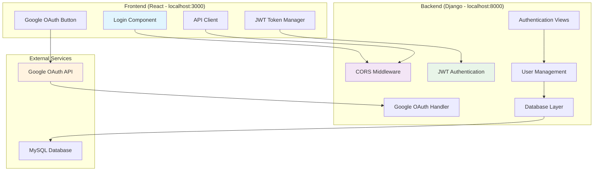

# Design Document: Authentication System Fix

## Overview

The E-Kalolsavam authentication system requires comprehensive fixes to address critical connectivity, CORS, OAuth, and JWT authentication issues. Based on previous investigations, the system has experienced failures due to missing dependencies, configuration issues, and improper error handling. This design provides a systematic approach to fix all authentication components and ensure reliable operation.

The system supports multiple user roles (admin, student, volunteer, school) with both traditional username/password authentication and Google OAuth integration. The architecture follows Django REST Framework patterns with JWT token-based authentication and proper CORS handling for React frontend communication.

## Architecture

### High-Level Architecture



### Component Interaction Flow

1. **Frontend Authentication Request** → CORS Middleware → Authentication Views
2. **Google OAuth Flow** → Google API → OAuth Handler → User Creation/Login
3. **JWT Token Management** → Token Validation → Protected Resource Access
4. **Database Operations** → User Model → Role-based Authorization

## Components and Interfaces

### 1. Backend Server Component

**Purpose**: Ensure reliable Django server startup and connectivity

**Key Interfaces**:
- Health check endpoint: `GET /api/health/`
- Server startup validation
- Environment variable validation
- Database connection management

**Dependencies**:
- `whitenoise` for static file serving
- `django-cors-headers` for CORS handling
- `mysqlclient` or `PyMySQL` for database connectivity

**Configuration Requirements**:
```python
# Required environment variables
SECRET_KEY = os.getenv('SECRET_KEY')
DEBUG = os.getenv('DEBUG', 'False') == 'True'
ALLOWED_HOSTS = os.getenv('ALLOWED_HOSTS', 'localhost,127.0.0.1').split(',')
DATABASE_NAME = os.getenv('DATABASE_NAME')
DATABASE_USER = os.getenv('DATABASE_USER')
DATABASE_PASSWORD = os.getenv('DATABASE_PASSWORD')
DATABASE_HOST = os.getenv('DATABASE_HOST', 'localhost')
DATABASE_PORT = os.getenv('DATABASE_PORT', '3306')
```

### 2. CORS Configuration Component

**Purpose**: Enable secure cross-origin requests between React frontend and Django backend

**Key Interfaces**:
- Preflight OPTIONS request handling
- Credential-based request support
- Custom header allowance

**Configuration**:
```python
CORS_ALLOW_CREDENTIALS = True
CORS_ALLOWED_ORIGINS = [
    "http://localhost:3000",
    "http://127.0.0.1:3000",
    "http://localhost:8001",
    "http://127.0.0.1:8001",
]
CORS_ALLOW_HEADERS = [
    'accept', 'accept-encoding', 'authorization', 'content-type',
    'dnt', 'origin', 'user-agent', 'x-csrftoken', 'x-requested-with'
]
CORS_ALLOW_METHODS = ['DELETE', 'GET', 'OPTIONS', 'PATCH', 'POST', 'PUT']
```

### 3. Google OAuth Integration Component

**Purpose**: Provide secure Google-based authentication

**Key Interfaces**:
- OAuth initiation: Frontend Google button
- Token verification: `POST /api/auth/google/`
- User creation/login flow
- Email allowlist validation

**Dependencies**:
- `google-auth` for token verification
- `google-auth-oauthlib` for OAuth flow
- `social-auth-app-django` for Django integration

**Configuration Requirements**:
```python
# Backend
SOCIAL_AUTH_GOOGLE_OAUTH2_KEY = os.getenv('SOCIAL_AUTH_GOOGLE_OAUTH2_KEY')
SOCIAL_AUTH_GOOGLE_OAUTH2_SECRET = os.getenv('SOCIAL_AUTH_GOOGLE_OAUTH2_SECRET')

# Frontend
REACT_APP_GOOGLE_CLIENT_ID = process.env.REACT_APP_GOOGLE_CLIENT_ID
```

**Google Cloud Console Requirements**:
- Authorized JavaScript origins: `http://localhost:3000`, `http://localhost:8000`
- Authorized redirect URIs: `http://localhost:8000/auth/complete/google-oauth2/`

### 4. JWT Token Management Component

**Purpose**: Secure token-based authentication and session management

**Key Interfaces**:
- Token generation: `POST /api/auth/login/`
- Token refresh: `POST /api/token/refresh/`
- Token validation: Middleware for protected endpoints
- Token blacklisting: Logout functionality

**Configuration**:
```python
SIMPLE_JWT = {
    'ACCESS_TOKEN_LIFETIME': timedelta(hours=24),
    'REFRESH_TOKEN_LIFETIME': timedelta(days=30),
    'ROTATE_REFRESH_TOKENS': True,
    'BLACKLIST_AFTER_ROTATION': True,
    'UPDATE_LAST_LOGIN': True,
    'ALGORITHM': 'HS256',
    'SIGNING_KEY': SECRET_KEY,
    'AUTH_HEADER_TYPES': ('Bearer',),
}
```

### 5. User Authentication Component

**Purpose**: Handle user login, registration, and role management

**Key Interfaces**:
- Standard login: `POST /api/auth/login/`
- User registration: `POST /api/auth/register/`
- Current user: `GET /api/auth/current/`
- Role validation: Permission classes

**Authentication Backends**:
```python
AUTHENTICATION_BACKENDS = (
    'django.contrib.auth.backends.ModelBackend',
    'users.backends.CaseInsensitiveAuth',
    'social_core.backends.google.GoogleOAuth2',
)
```

### 6. WebSocket Support Component

**Purpose**: Enable real-time features with proper authentication

**Key Interfaces**:
- WebSocket connection establishment
- JWT token validation for WebSocket
- Connection cleanup and error handling

**Configuration Requirements**:
- WebSocket CORS support
- Token-based WebSocket authentication
- Connection state management

## Data Models

### User Model Extensions

```python
class User(AbstractUser):
    ROLE_CHOICES = [
        ('student', 'Student'),
        ('judge', 'Judge'),
        ('admin', 'Admin'),
        ('volunteer', 'Volunteer'),
        ('school', 'School')
    ]
    
    role = models.CharField(max_length=20, choices=ROLE_CHOICES)
    approval_status = models.CharField(
        max_length=10, 
        choices=[('pending', 'Pending'), ('approved', 'Approved'), ('rejected', 'Rejected')],
        default='pending'
    )
    registration_id = models.CharField(max_length=50, blank=True, null=True)
    must_reset_password = models.BooleanField(default=False)
```

### Authentication Session Model

```python
class AuthenticationSession(models.Model):
    user = models.ForeignKey(User, on_delete=models.CASCADE)
    session_token = models.CharField(max_length=255, unique=True)
    refresh_token = models.CharField(max_length=255, unique=True)
    created_at = models.DateTimeField(auto_now_add=True)
    expires_at = models.DateTimeField()
    is_active = models.BooleanField(default=True)
    ip_address = models.GenericIPAddressField(null=True, blank=True)
    user_agent = models.TextField(blank=True)
```

### Authentication Log Model

```python
class AuthenticationLog(models.Model):
    LOG_TYPES = [
        ('login_success', 'Login Success'),
        ('login_failure', 'Login Failure'),
        ('oauth_success', 'OAuth Success'),
        ('oauth_failure', 'OAuth Failure'),
        ('token_refresh', 'Token Refresh'),
        ('logout', 'Logout'),
    ]
    
    user = models.ForeignKey(User, on_delete=models.CASCADE, null=True, blank=True)
    log_type = models.CharField(max_length=20, choices=LOG_TYPES)
    ip_address = models.GenericIPAddressField()
    user_agent = models.TextField()
    details = models.JSONField(default=dict)
    timestamp = models.DateTimeField(auto_now_add=True)
```

Now I need to use the prework tool to analyze the acceptance criteria before writing the Correctness Properties section:

<function_calls>
<invoke name="prework">
<parameter name="featureName">authentication-system-fix

## Correctness Properties

*A property is a characteristic or behavior that should hold true across all valid executions of a system-essentially, a formal statement about what the system should do. Properties serve as the bridge between human-readable specifications and machine-verifiable correctness guarantees.*

Based on the prework analysis, the following properties validate the authentication system's correctness:

### Property 1: Server startup error logging
*For any* server startup error condition, the system should log detailed error messages that include the specific cause and suggested resolution steps.
**Validates: Requirements 1.3**

### Property 2: Database connection error handling
*For any* database connection failure, the system should provide clear error messages and implement retry mechanisms with exponential backoff.
**Validates: Requirements 1.4, 9.2**

### Property 3: Environment variable validation
*For any* missing required environment variable, the system should fail startup with a specific error message identifying the missing variable.
**Validates: Requirements 1.5, 6.1**

### Property 4: Comprehensive CORS handling
*For any* valid cross-origin request from allowed origins, the CORS handler should properly handle preflight OPTIONS requests, allow credentials, accept custom headers, and support all HTTP methods.
**Validates: Requirements 2.2, 2.3, 2.4, 2.5**

### Property 5: OAuth user profile extraction
*For any* successful Google OAuth response, the system should extract and return complete user profile information including email, name, and profile data.
**Validates: Requirements 3.2**

### Property 6: OAuth user account management
*For any* OAuth callback received, the system should create new user accounts for first-time users or update existing accounts for returning users.
**Validates: Requirements 3.3**

### Property 7: Email allowlist validation
*For any* OAuth authentication attempt with an email not in the allowlist, the system should reject the authentication and provide a clear error message.
**Validates: Requirements 3.4**

### Property 8: OAuth error handling
*For any* OAuth error condition, the system should provide user-friendly error messages without exposing sensitive technical details.
**Validates: Requirements 3.5**

### Property 9: OAuth origin validation
*For any* OAuth request from an unauthorized origin, the system should reject the request and validate only configured domains.
**Validates: Requirements 3.6**

### Property 10: JWT token generation
*For any* successful user authentication, the JWT manager should generate both access and refresh tokens with proper expiration times and signatures.
**Validates: Requirements 4.1**

### Property 11: Token refresh functionality
*For any* expired access token with a valid refresh token, the system should generate a new access token and optionally rotate the refresh token.
**Validates: Requirements 4.2**

### Property 12: Comprehensive token validation
*For any* invalid token (expired, malformed, or with invalid signature), the system should reject requests with 401 status and validate all token components.
**Validates: Requirements 4.3, 4.5**

### Property 13: Token blacklisting on logout
*For any* user logout action, the system should blacklist the associated refresh token to prevent future use.
**Validates: Requirements 4.4**

### Property 14: Token refresh failure handling
*For any* token refresh attempt with an invalid refresh token, the system should require complete re-authentication.
**Validates: Requirements 4.6**

### Property 15: Role assignment during authentication
*For any* user authentication, the system should assign the correct role based on user data and maintain role consistency.
**Validates: Requirements 5.1**

### Property 16: Role-based access control
*For any* role-specific endpoint access, the system should validate user permissions and enforce role-based restrictions.
**Validates: Requirements 5.2**

### Property 17: Unauthorized access handling
*For any* unauthorized access attempt, the system should return 403 Forbidden status with appropriate error messaging.
**Validates: Requirements 5.3**

### Property 18: Multi-role support
*For any* user role (admin, student, volunteer, school), the system should handle authentication and authorization correctly.
**Validates: Requirements 5.4**

### Property 19: Dynamic permission updates
*For any* user role change, the system should update permissions immediately without requiring re-authentication.
**Validates: Requirements 5.5**

### Property 20: OAuth configuration validation
*For any* invalid Google OAuth configuration, the system should report specific OAuth-related error messages during startup or runtime.
**Validates: Requirements 6.2**

### Property 21: Database configuration validation
*For any* incorrect database credentials, the system should provide detailed connection error information.
**Validates: Requirements 6.3**

### Property 22: URL and port validation
*For any* invalid URL format or unavailable port configuration, the system should validate and report specific configuration errors.
**Validates: Requirements 6.5**

### Property 23: WebSocket connection establishment
*For any* WebSocket connection attempt, the system should establish connections successfully and handle connection state properly.
**Validates: Requirements 7.1**

### Property 24: WebSocket authentication
*For any* WebSocket connection requiring authentication, the system should validate JWT tokens and enforce authentication requirements.
**Validates: Requirements 7.2**

### Property 25: WebSocket error handling and retry
*For any* WebSocket connection failure, the system should provide retry mechanisms and handle connection errors gracefully.
**Validates: Requirements 7.3**

### Property 26: WebSocket resource cleanup
*For any* WebSocket disconnection, the system should clean up associated resources and connection state properly.
**Validates: Requirements 7.4**

### Property 27: WebSocket CORS support
*For any* cross-origin WebSocket request, the system should support CORS and allow connections from authorized origins.
**Validates: Requirements 7.5**

### Property 28: Comprehensive error logging
*For any* authentication error or server error, the system should log detailed information including stack traces while sanitizing sensitive data.
**Validates: Requirements 8.1, 8.4, 8.5**

### Property 29: Network error retry mechanisms
*For any* network error condition, the system should implement appropriate retry mechanisms with backoff strategies.
**Validates: Requirements 8.2**

### Property 30: Validation error reporting
*For any* validation failure, the system should return specific field-level error messages that help users correct their input.
**Validates: Requirements 8.3**

### Property 31: Connection pool management
*For any* database connection pool exhaustion, the system should queue requests appropriately and manage connection resources.
**Validates: Requirements 9.3**

### Property 32: Database backend support
*For any* supported database backend (MySQL or SQLite), the system should operate correctly with proper configuration.
**Validates: Requirements 9.5**

### Property 33: Comprehensive security implementation
*For any* HTTP response, the system should include appropriate security headers, use secure cookie flags, validate CSRF tokens when enabled, and implement proper session security measures.
**Validates: Requirements 10.1, 10.2, 10.3, 10.5**

### Property 34: HTTPS enforcement in production
*For any* HTTP request in production mode, the system should enforce HTTPS redirects and secure communication.
**Validates: Requirements 10.4**

## Error Handling

### Error Categories and Handling Strategies

**1. Server Startup Errors**
- Missing dependencies: Clear installation instructions
- Configuration errors: Specific variable identification
- Database connection failures: Connection string validation
- Port binding issues: Port availability checking

**2. Authentication Errors**
- Invalid credentials: Generic "invalid credentials" message
- Expired tokens: Token refresh guidance
- OAuth failures: User-friendly OAuth error messages
- Permission denied: Clear authorization error messages

**3. Network and Communication Errors**
- CORS violations: Detailed CORS configuration guidance
- WebSocket failures: Connection retry mechanisms
- API timeouts: Timeout handling with retry logic
- Database connectivity: Connection pool management

**4. Validation Errors**
- Field-level validation: Specific field error messages
- Data format errors: Format requirement specifications
- Business rule violations: Clear business logic explanations
- Security violations: Sanitized security error messages

### Error Response Format

```json
{
  "error": {
    "code": "AUTHENTICATION_FAILED",
    "message": "Invalid credentials provided",
    "details": {
      "field": "password",
      "reason": "Password does not match"
    },
    "timestamp": "2024-01-01T12:00:00Z",
    "request_id": "req_123456789"
  }
}
```

### Logging Strategy

**Log Levels:**
- ERROR: Authentication failures, server errors, security violations
- WARN: Configuration issues, deprecated usage, performance concerns
- INFO: Successful authentications, system startup, configuration changes
- DEBUG: Detailed request/response data, token operations, database queries

**Log Format:**
```
[TIMESTAMP] [LEVEL] [COMPONENT] [REQUEST_ID] MESSAGE
2024-01-01 12:00:00 ERROR AUTH req_123 Authentication failed for user: invalid_password
```

## Testing Strategy

### Dual Testing Approach

The authentication system requires both unit testing and property-based testing for comprehensive coverage:

**Unit Tests**: Focus on specific examples, edge cases, and integration points
- Specific authentication scenarios (valid/invalid credentials)
- OAuth callback handling with known test data
- Error conditions with specific inputs
- Integration between components

**Property Tests**: Verify universal properties across all inputs
- Token validation across all possible token formats
- CORS handling for all origin combinations
- Error handling for all error conditions
- Security measures across all request types

### Property-Based Testing Configuration

**Testing Framework**: Use `hypothesis` for Python property-based testing
**Test Configuration**: Minimum 100 iterations per property test
**Test Tagging**: Each property test must reference its design document property

**Example Property Test Structure**:
```python
from hypothesis import given, strategies as st
import pytest

@given(st.text(), st.text())
def test_token_validation_property(access_token, refresh_token):
    """
    Feature: authentication-system-fix, Property 12: Comprehensive token validation
    For any invalid token, the system should reject requests with 401 status
    """
    # Test implementation
    pass
```

### Test Coverage Requirements

**Backend Testing**:
- Authentication views: 100% line coverage
- JWT token management: 100% branch coverage
- CORS middleware: All configuration scenarios
- OAuth integration: All callback scenarios
- Error handling: All error paths

**Frontend Testing**:
- Login component: All user interactions
- OAuth button: Success and failure flows
- Token management: Storage and refresh logic
- API client: All authentication scenarios

**Integration Testing**:
- End-to-end authentication flows
- Cross-origin request handling
- WebSocket authentication
- Database connection management

### Performance Testing

**Load Testing Scenarios**:
- Concurrent login attempts: 100 users/second
- Token refresh operations: 500 requests/second
- OAuth callback processing: 50 callbacks/second
- WebSocket connections: 1000 concurrent connections

**Performance Benchmarks**:
- Authentication response time: < 200ms
- Token validation time: < 50ms
- Database query time: < 100ms
- CORS preflight response: < 10ms


## 4. Login Page Auto-Refresh Component

### Purpose

The Login Page Auto-Refresh component ensures that after logout, the login page automatically refreshes to clear any cached authentication state, providing users with a clean login interface free from stale data or UI artifacts.

### Key Interfaces

**Detection Mechanism**:
```typescript
interface LogoutDetection {
  checkLogoutParameter(): boolean;
  clearAuthenticationState(): void;
  performRefresh(): void;
}
```

**SessionStorage Protection**:
```typescript
interface RefreshProtection {
  hasRefreshed(): boolean;
  markAsRefreshed(): void;
  clearRefreshFlag(): void;
}
```

### Implementation Approach

**URL Parameter Detection**:
- Monitor URL for `?logout=true` parameter on login page mount
- Detect logout scenario immediately when component initializes
- Parse URL parameters using URLSearchParams API

**Token Clearing Flow**:
1. Detect `?logout=true` parameter
2. Clear localStorage tokens (access_token, refresh_token)
3. Clear sessionStorage authentication data
4. Clear any cookies related to authentication

**Refresh Protection Mechanism**:
- Use sessionStorage flag `hasRefreshedAfterLogout` to track refresh state
- Set flag BEFORE performing refresh to prevent loops
- Flag persists only for current tab session
- Automatically cleared when tab is closed

**Refresh Execution**:
```typescript
// Pseudocode for refresh logic
if (urlParams.has('logout') && !sessionStorage.getItem('hasRefreshedAfterLogout')) {
  // Clear all auth tokens
  localStorage.removeItem('access_token');
  localStorage.removeItem('refresh_token');
  sessionStorage.clear();
  
  // Set protection flag
  sessionStorage.setItem('hasRefreshedAfterLogout', 'true');
  
  // Perform refresh
  window.location.href = '/login';
}
```

### Edge Cases

**Multiple Tabs**:
- Each tab maintains independent sessionStorage
- Refresh occurs independently per tab
- No cross-tab interference due to sessionStorage isolation

**Browser Back Button**:
- After refresh, URL no longer contains `?logout=true`
- Back button navigation does not re-trigger refresh
- Clean URL history after refresh

**Direct Navigation**:
- Direct navigation to `/login` without logout parameter does not trigger refresh
- Only logout-initiated navigation triggers refresh
- Manual page refresh does not trigger auto-refresh

**Session Expiry**:
- Token expiry redirects to login without `?logout=true`
- No auto-refresh on session expiry (different from explicit logout)
- User sees login page immediately without refresh delay

### Correctness Properties

**Property 35: Single Refresh Guarantee**
```
For any logout event, the login page SHALL refresh exactly once per tab session
```

**Property 36: Token Clearing Completeness**
```
For any auto-refresh trigger, ALL authentication tokens SHALL be cleared before refresh
```

**Property 37: Refresh Loop Prevention**
```
For any sequence of page loads, the auto-refresh mechanism SHALL NOT cause infinite loops
```

**Property 38: Performance Constraint**
```
For any logout-triggered refresh, the refresh SHALL complete within 100ms of detection
```

### Testing Strategy

**Unit Tests**:
- URL parameter detection with various query strings
- Token clearing with different storage states
- SessionStorage flag management
- Refresh execution timing

**Property-Based Tests**:
- Property 35: Test with random logout sequences
- Property 36: Test with random token combinations
- Property 37: Test with random page navigation patterns
- Property 38: Test refresh timing across multiple iterations

**Integration Tests**:
- Complete logout-to-login flow
- Multiple tab scenarios
- Browser back/forward navigation
- Direct URL access patterns
