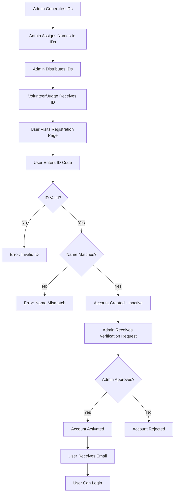

# ID Pre-Registration System - Complete Implementation Guide

## 🎯 Overview

The ID Pre-Registration System allows admins to generate volunteer and judge IDs with pre-assigned names, distribute them, and verify registrations when those individuals sign up.

## 🔄 Workflow



## 📋 Features

### For Admins

1. **ID Generation with Names**
   - Generate multiple IDs at once
   - Assign full names to each ID
   - Optional phone number verification
   - Add internal notes

2. **ID Management**
   - View all generated IDs
   - Filter by status (Available, Used, Verified, Inactive)
   - Search by ID code, name, or username
   - Activate/deactivate IDs

3. **Verification Workflow**
   - Review pending registrations
   - Verify user details match assigned names
   - Approve or reject accounts
   - Send automated email notifications

### For Volunteers/Judges

1. **ID-Based Registration**
   - Enter assigned ID code
   - System validates ID availability
   - Name verification against assignment
   - Create account (inactive until verified)

2. **Status Tracking**
   - Pending verification status
   - Email notification on approval
   - Login access after activation

## 🚀 Implementation Details

### Database Schema

#### AdminIssuedID Model
```python
- id_code: CharField (unique, e.g., VOL1234, JUD5678)
- role: CharField ('volunteer' or 'judge')
- assigned_name: CharField (pre-assigned name)
- assigned_phone: CharField (optional phone for verification)
- is_active: BooleanField (can be used for registration)
- is_used: BooleanField (someone registered with this ID)
- is_verified: BooleanField (admin verified the registration)
- used_by: ForeignKey to User (who registered)
- verified_by: ForeignKey to User (admin who verified)
- notes: TextField (admin notes)
- timestamps: created_at, used_at, verified_at
```

### API Endpoints

#### Admin Endpoints

**Generate IDs**
```
POST /api/auth/admin/ids/generate/
Authorization: Bearer <admin_token>

Request:
{
  "role": "volunteer",
  "assignments": [
    {"name": "John Doe", "phone": "9876543210", "notes": "Team A"},
    {"name": "Jane Smith", "phone": "9123456789"}
  ]
}

Response:
{
  "ids": [
    {
      "id_code": "VOL1234",
      "role": "volunteer",
      "assigned_name": "John Doe",
      "assigned_phone": "9876543210",
      "notes": "Team A",
      "status_display": "Available"
    }
  ],
  "count": 2,
  "message": "Successfully generated 2 volunteer ID(s)"
}
```

**List IDs**
```
GET /api/auth/admin/ids/?role=volunteer&status=available&search=john
Authorization: Bearer <admin_token>

Response: Array of AdminIssuedID objects
```

**Update ID**
```
PATCH /api/auth/admin/ids/<id>/
Authorization: Bearer <admin_token>

Request:
{
  "assigned_name": "Updated Name",
  "is_active": false
}
```

**List Pending Verifications**
```
GET /api/auth/admin/signup-requests/?status=pending
Authorization: Bearer <admin_token>

Response:
[
  {
    "id": 1,
    "issued_id_code": "VOL1234",
    "user_details": {
      "username": "johndoe",
      "email": "john@gmail.com",
      "first_name": "John",
      "last_name": "Doe"
    },
    "status": "pending"
  }
]
```

**Approve/Reject Registration**
```
PATCH /api/auth/admin/signup-requests/<id>/
Authorization: Bearer <admin_token>

Request:
{
  "status": "approved",  // or "rejected"
  "notes": "Verified identity"
}

Response:
{
  "message": "Request approved successfully"
}
```

#### Public Endpoints

**Check ID Validity**
```
POST /api/auth/ids/check/

Request:
{
  "id_code": "VOL1234"
}

Response (Valid):
{
  "valid": true,
  "role": "volunteer",
  "assigned_name": "John Doe",
  "message": "Valid volunteer ID"
}

Response (Invalid):
{
  "valid": false,
  "error": "This ID has already been used"
}
```

**Register with ID**
```
POST /api/auth/register/with-id/

Request:
{
  "id_code": "VOL1234",
  "username": "johndoe",
  "password": "SecurePass123",
  "email": "john@gmail.com",
  "first_name": "John",
  "last_name": "Doe",
  "phone": "9876543210"
}

Response:
{
  "message": "Registration successful! Your volunteer account is pending admin verification...",
  "user": {
    "id": 123,
    "username": "johndoe",
    "role": "volunteer",
    "status": "pending_verification"
  }
}
```

## 🎨 Frontend Components

### 1. IDManagementEnhanced Component
**Location:** `frontend/src/components/IDManagementEnhanced.js`

**Features:**
- Generate IDs with name assignments
- Manage existing IDs (view, filter, search)
- Review and approve pending verifications
- Real-time status updates

**Usage in Admin Panel:**
```javascript
import IDManagement from '../components/IDManagementEnhanced';
// Renders in Admin Panel under "ID Management" section
```

### 2. IDBasedRegistration Component
**Location:** `frontend/src/pages/IDBasedRegistration.js`

**Features:**
- Two-step registration process
- ID verification
- Name validation
- Form completion
- Success confirmation

**Route:** `/register-with-id`

## 📝 Usage Guide

### For Administrators

#### Step 1: Generate IDs

1. Navigate to **Admin Panel → ID Management → Generate IDs**
2. Select role (Volunteer or Judge)
3. Click "Add Person" to add name assignments
4. Fill in:
   - Full Name (required)
   - Phone (optional, for verification)
   - Notes (optional, internal use)
5. Click "Generate IDs"
6. Copy generated IDs from the list

#### Step 2: Distribute IDs

- Copy generated IDs (click "Copy All IDs")
- Share with volunteers/judges via:
  - Email
  - WhatsApp
  - Printed sheets
  - In-person

**Example Distribution:**
```
Volunteer IDs for Event Coordination:
- VOL1234 - John Doe (Team A)
- VOL5678 - Jane Smith (Team B)
```

#### Step 3: Manage IDs

1. Navigate to **Manage IDs** tab
2. Filter by:
   - Role (Volunteer/Judge)
   - Status (Available/Used/Verified/Inactive)
   - Search (ID code, name, username)
3. View ID details:
   - Assigned name
   - Usage status
   - Registered user info
4. Deactivate IDs if needed

#### Step 4: Verify Registrations

1. Navigate to **Pending Verifications** tab
2. Review each request:
   - Name match verification
   - Contact information
   - Email verification
3. Actions:
   - **Approve**: Activates account, sends welcome email
   - **Reject**: Deactivates account, sends rejection email with reason

### For Volunteers/Judges

#### Step 1: Receive ID

- Get your assigned ID from admin (e.g., VOL1234)
- Note down your ID code

#### Step 2: Register

1. Visit: `https://your-domain.com/register-with-id`
2. Enter your ID code
3. Click "Verify ID"
4. If valid, you'll see:
   - Your assigned name (if set)
   - Registration form

#### Step 3: Complete Registration

Fill in the form:
- First Name & Last Name (must match assigned name)
- Username (unique)
- Email
- Phone (must match if pre-assigned)
- Password (min 8 characters)
- Confirm Password

#### Step 4: Wait for Verification

- Account created but inactive
- Email sent: "Registration received"
- Wait for admin approval
- Receive activation email

#### Step 5: Login

- After approval, login with:
  - Username
  - Password
- Access your dashboard

## 🔒 Security Features

1. **ID Validation**
   - Unique ID codes
   - Active status check
   - One-time use enforcement

2. **Name Verification**
   - Pre-assigned names verified on registration
   - Phone number verification (optional)
   - Prevents identity fraud

3. **Admin Verification**
   - Manual approval required
   - Account inactive until verified
   - Admin can reject with reason

4. **Email Notifications**
   - Registration confirmation
   - Approval notification
   - Rejection notification with reason

## 🧪 Testing

### Test Script
**File:** `test_id_preregistration_system.py`

```python
# Run backend first:
cd backend
python manage.py runserver

# In another terminal:
python test_id_preregistration_system.py
```

### Manual Testing Checklist

#### Admin Flow
- [ ] Generate IDs without names
- [ ] Generate IDs with names
- [ ] View all IDs
- [ ] Filter IDs by status
- [ ] Search IDs
- [ ] Deactivate an ID
- [ ] Reactivate an ID
- [ ] Approve a registration
- [ ] Reject a registration

#### User Flow
- [ ] Check invalid ID
- [ ] Check valid but used ID
- [ ] Check valid available ID
- [ ] Register with correct name
- [ ] Register with wrong name (should fail)
- [ ] Register with mismatched phone (should fail)
- [ ] Complete registration successfully
- [ ] Try to login before approval (should fail)
- [ ] Login after approval (should succeed)

## 📊 Database Migrations

### Applied Migration
```
0011_adminissuedid_assigned_name_and_more.py
```

**Changes:**
- Added `assigned_name` field
- Added `assigned_phone` field
- Added `is_active` field
- Added `is_verified` field
- Added `verified_at` field
- Added `verified_by` field
- Added `notes` field

### Run Migrations
```bash
cd backend
python manage.py makemigrations
python manage.py migrate
```

## 🐛 Troubleshooting

### ID Not Found
**Error:** "Invalid ID code"
- Check ID is correctly typed
- Verify ID hasn't been deactivated
- Contact admin for new ID

### Name Mismatch
**Error:** "Name does not match our records"
- Verify your name spelling
- Check with admin for assigned name
- Contact admin if error persists

### Already Used
**Error:** "This ID has already been used"
- ID can only be used once
- Contact admin for a new ID

### Not Approved Yet
**Error:** "Authentication failed" on login
- Account pending admin verification
- Check email for updates
- Contact admin if delayed

## 📧 Email Templates

### Registration Received
```
Subject: Volunteer Registration Received - E-Kalolsavam

Dear [First Name],

Your volunteer registration has been received with ID: [ID_CODE]

Your account is currently pending admin verification. You will receive an email once your account is activated.

Username: [username]
Role: Volunteer

Please do not share your login credentials with anyone.

Thank you for joining E-Kalolsavam!
```

### Account Approved
```
Subject: Volunteer Account Approved - E-Kalolsavam

Dear [First Name],

Congratulations! Your volunteer account has been approved and activated.

You can now log in to the E-Kalolsavam platform using your credentials:
Username: [username]

Please keep your login credentials secure.

Welcome to the E-Kalolsavam team!
```

### Account Rejected
```
Subject: Volunteer Registration Update - E-Kalolsavam

Dear [First Name],

Thank you for your interest in joining E-Kalolsavam as a volunteer.

After review, we regret to inform you that your registration could not be approved.
Reason: [rejection_reason]

If you believe this is an error, please contact the admin team.

Thank you for your understanding.
```

## 🎓 Best Practices

### For Admins

1. **Pre-Register Known Volunteers**
   - Generate IDs with names before event
   - Verify phone numbers when possible
   - Keep notes for internal tracking

2. **Regular Verification**
   - Check pending requests daily
   - Verify identities promptly
   - Communicate rejection reasons

3. **ID Management**
   - Deactivate unused IDs after event
   - Keep track of who has which ID
   - Export ID list for records

### For System Management

1. **Database Backup**
   - Regular backups before events
   - Export ID list periodically

2. **Monitoring**
   - Check for suspicious registrations
   - Monitor approval rates
   - Track activation delays

3. **Communication**
   - Inform users about verification timeline
   - Provide helpdesk contact
   - Send reminders if needed

## 🔄 Future Enhancements

Potential improvements:

1. **Bulk Operations**
   - Import IDs from CSV
   - Export ID list to Excel
   - Bulk approve/reject

2. **SMS Notifications**
   - Send ID via SMS
   - OTP verification
   - Status updates via SMS

3. **QR Codes**
   - Generate QR codes for IDs
   - Scan QR to auto-fill registration
   - Print ID cards with QR

4. **Analytics**
   - Registration rate tracking
   - Verification timeline metrics
   - Usage statistics dashboard

5. **Integration**
   - Direct email sending from system
   - WhatsApp integration
   - Calendar integration for verification

## 📞 Support

For issues or questions:
1. Check this documentation
2. Review error messages carefully
3. Contact admin team
4. Submit bug reports with details

---

**Version:** 2.0  
**Last Updated:** October 26, 2025  
**Author:** E-Kalolsavam Development Team
