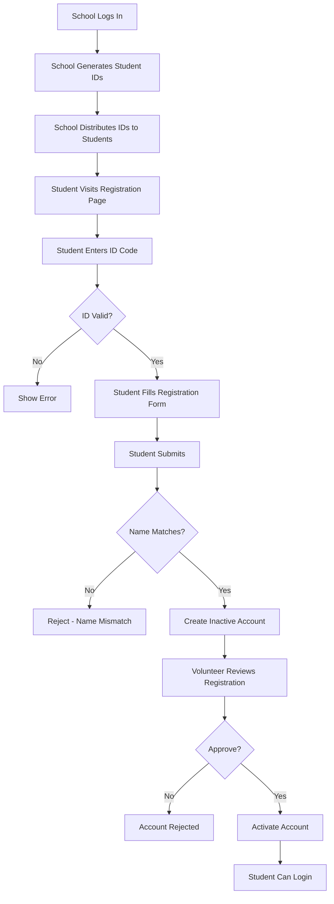

# 🎓 Student ID Pre-Registration System - Complete Guide

**Date:** October 26, 2025  
**Status:** ✅ Fully Implemented

---

## 📋 Overview

The Student ID Pre-Registration System allows schools to generate Student IDs that students use to sign up on the platform. This mirrors the volunteer/judge ID workflow and ensures proper verification before student access.

---

## 🔄 Complete Workflow



---

## 👥 Roles & Responsibilities

### **1. School (Pre-Registration)**
- ✅ Generates Student IDs with student details
- ✅ Assigns name, phone (optional), and class
- ✅ Distributes IDs to students
- ✅ Tracks which IDs have been issued

### **2. Student (Registration)**
- ✅ Receives Student ID from school
- ✅ Visits `/register-with-id` page
- ✅ Enters ID code and personal details
- ✅ Waits for volunteer verification

### **3. Volunteer (Verification)**
- ✅ Reviews pending student registrations
- ✅ Verifies student details match school records
- ✅ Approves or rejects registration
- ✅ Activates approved student accounts

### **4. Admin (Optional Oversight)**
- ✅ Can view all student IDs
- ✅ Can manually verify if needed
- ✅ Has full control over system

---

## 🔧 Backend Implementation

### **New Endpoint:**

#### **POST `/api/auth/schools/students/generate-ids/`**

**Purpose:** Schools generate Student IDs for pre-registration

**Authentication:** Required (School role only)

**Request Body:**
```json
{
  "students": [
    {
      "name": "John Doe",
      "phone": "+919876543210",
      "student_class": 10,
      "notes": "Morning batch"
    },
    {
      "name": "Jane Smith",
      "phone": "+919876543211",
      "student_class": 12
    }
  ]
}
```

**Response:**
```json
{
  "ids": [
    {
      "id": 1,
      "id_code": "STU1234",
      "role": "student",
      "assigned_name": "John Doe",
      "assigned_phone": "+919876543210",
      "notes": "School: XYZ High School | Class: 10 | Morning batch",
      "is_active": true,
      "is_used": false,
      "status_display": "Available"
    },
    {
      "id": 2,
      "id_code": "STU5678",
      "role": "student",
      "assigned_name": "Jane Smith",
      "assigned_phone": "+919876543211",
      "notes": "School: XYZ High School | Class: 12",
      "is_active": true,
      "is_used": false,
      "status_display": "Available"
    }
  ],
  "count": 2,
  "message": "Successfully generated 2 student ID(s)"
}
```

**Validation:**
- ✅ Only school role can access
- ✅ Maximum 100 students per request
- ✅ Name is required for each student
- ✅ Unique ID codes generated (STU + 4 digits)
- ✅ School info automatically added to notes

---

### **Existing Endpoint (Updated):**

#### **POST `/api/auth/register/with-id/`**

**Purpose:** Students register using their Student ID

**Authentication:** Public (No auth required)

**Request Body:**
```json
{
  "id_code": "STU1234",
  "username": "john_doe",
  "password": "securepassword123",
  "email": "john@example.com",
  "first_name": "John",
  "last_name": "Doe",
  "phone": "+919876543210"
}
```

**Validation Rules:**
1. **ID Must Exist** - ID code must be in database
2. **ID Must Be Active** - Not deactivated by admin
3. **ID Not Already Used** - One-time use per ID
4. **Name Must Match** - First+Last name must match `assigned_name`
5. **Phone Must Match** (if provided) - Phone number verification
6. **Username Unique** - Username not taken
7. **Email Unique** - Email not registered

**Response (Success):**
```json
{
  "message": "Registration successful! Your student account is pending admin verification. You will be notified via email once approved.",
  "user": {
    "id": 123,
    "username": "john_doe",
    "role": "student",
    "status": "pending_verification"
  }
}
```

**Account Status:**
- ✅ Account created but **INACTIVE**
- ✅ `approval_status` = "pending"
- ✅ `is_active` = False
- ✅ Student receives email notification
- ✅ ID marked as "used"

---

## 📱 Frontend Implementation Guide

### **School Dashboard - Generate Student IDs**

**Location:** School Dashboard → Student ID Management Tab

**UI Components:**

```javascript
// Example React Component
import React, { useState } from 'react';
import http from '../services/http-common';

const StudentIDGenerator = () => {
  const [students, setStudents] = useState([
    { name: '', phone: '', student_class: '', notes: '' }
  ]);
  const [generatedIDs, setGeneratedIDs] = useState([]);
  const [loading, setLoading] = useState(false);

  const addStudent = () => {
    setStudents([...students, { name: '', phone: '', student_class: '', notes: '' }]);
  };

  const removeStudent = (index) => {
    setStudents(students.filter((_, i) => i !== index));
  };

  const handleChange = (index, field, value) => {
    const newStudents = [...students];
    newStudents[index][field] = value;
    setStudents(newStudents);
  };

  const generateIDs = async () => {
    setLoading(true);
    try {
      const response = await http.post('/api/auth/schools/students/generate-ids/', {
        students: students.filter(s => s.name.trim())
      });
      setGeneratedIDs(response.data.ids);
      alert(`Successfully generated ${response.data.count} student ID(s)!`);
    } catch (error) {
      alert(error.response?.data?.error || 'Failed to generate IDs');
    } finally {
      setLoading(false);
    }
  };

  return (
    <div className="p-6">
      <h2 className="text-2xl font-bold mb-4">Generate Student IDs</h2>
      
      {students.map((student, index) => (
        <div key={index} className="mb-4 p-4 border rounded">
          <input
            type="text"
            placeholder="Student Name *"
            value={student.name}
            onChange={(e) => handleChange(index, 'name', e.target.value)}
            className="w-full p-2 border rounded mb-2"
            required
          />
          <input
            type="tel"
            placeholder="Phone Number (optional)"
            value={student.phone}
            onChange={(e) => handleChange(index, 'phone', e.target.value)}
            className="w-full p-2 border rounded mb-2"
          />
          <input
            type="number"
            placeholder="Class (1-12)"
            value={student.student_class}
            onChange={(e) => handleChange(index, 'student_class', e.target.value)}
            className="w-full p-2 border rounded mb-2"
            min="1"
            max="12"
          />
          <input
            type="text"
            placeholder="Notes (optional)"
            value={student.notes}
            onChange={(e) => handleChange(index, 'notes', e.target.value)}
            className="w-full p-2 border rounded mb-2"
          />
          <button
            onClick={() => removeStudent(index)}
            className="text-red-600 hover:text-red-800"
          >
            Remove
          </button>
        </div>
      ))}

      <div className="flex gap-4">
        <button
          onClick={addStudent}
          className="px-4 py-2 bg-blue-600 text-white rounded hover:bg-blue-700"
        >
          Add Another Student
        </button>
        <button
          onClick={generateIDs}
          disabled={loading}
          className="px-4 py-2 bg-green-600 text-white rounded hover:bg-green-700 disabled:bg-gray-400"
        >
          {loading ? 'Generating...' : 'Generate IDs'}
        </button>
      </div>

      {/* Display Generated IDs */}
      {generatedIDs.length > 0 && (
        <div className="mt-6">
          <h3 className="text-xl font-bold mb-4">Generated Student IDs</h3>
          <div className="space-y-2">
            {generatedIDs.map((id) => (
              <div key={id.id} className="p-4 bg-green-50 border border-green-200 rounded">
                <div className="font-bold text-lg">{id.id_code}</div>
                <div>Student: {id.assigned_name}</div>
                {id.assigned_phone && <div>Phone: {id.assigned_phone}</div>}
                <div className="text-sm text-gray-600">{id.notes}</div>
              </div>
            ))}
          </div>
          
          {/* Print/Export Button */}
          <button
            onClick={() => window.print()}
            className="mt-4 px-4 py-2 bg-gray-600 text-white rounded hover:bg-gray-700"
          >
            Print ID List
          </button>
        </div>
      )}
    </div>
  );
};

export default StudentIDGenerator;
```

---

### **Student Registration Page (Existing)**

**Location:** `/register-with-id`

**What To Update:**
- ✅ Page already exists and works for volunteers/judges
- ✅ Now also works for students automatically
- ✅ No changes needed - it handles all roles!

**User Flow:**
1. Student visits `/register-with-id`
2. Enters Student ID (e.g., `STU1234`)
3. System validates ID
4. Student fills in form (username, password, email, name, phone)
5. System validates name matches ID
6. Account created (inactive, pending verification)
7. Student receives confirmation email

---

## 🔐 Security Features

### **Name Verification:**
- System compares student's entered name with `assigned_name`
- Prevents identity fraud
- Case-insensitive matching
- Allows minor variations

### **Phone Verification (Optional):**
- If phone provided during ID generation
- Must match during registration
- Digit-only comparison (ignores formatting)

### **One-Time Use:**
- Each ID can only be used once
- Prevents duplicate registrations
- ID marked as "used" after registration

### **Volunteer Verification:**
- All student accounts start INACTIVE
- Requires volunteer/admin approval
- Email notification on approval
- Cannot login until verified

---

## 📊 ID Status Types

| Status | Description | Can Register? | Can Login? |
|--------|-------------|---------------|------------|
| **Available** | ID generated, not used yet | ✅ Yes | ❌ No |
| **Pending Verification** | ID used, account created, awaiting approval | ❌ No (already used) | ❌ No |
| **Verified** | Account approved and active | ❌ No (already used) | ✅ Yes |
| **Inactive** | ID deactivated by admin | ❌ No | ❌ No |

---

## 📧 Email Notifications

### **Student Registration Email:**
```
Subject: Student Registration Received - E-Kalolsavam

Dear [First Name],

Your student registration has been received with ID: [ID_CODE]

Your account is currently pending admin verification. You will receive 
an email once your account is activated.

Username: [username]
Role: Student

Please do not share your login credentials with anyone.

Thank you for joining E-Kalolsavam!
```

### **Account Approval Email:**
```
Subject: Student Account Approved - E-Kalolsavam

Dear [First Name],

Congratulations! Your student account has been approved and activated.

You can now log in to the E-Kalolsavam platform using your credentials:
Username: [username]

Please keep your login credentials secure and do not share them with anyone.

Welcome to the E-Kalolsavam team!

Best regards,
E-Kalolsavam Admin Team
```

---

## 🧪 Testing Guide

### **Test as School:**

1. **Login as school:**
   ```
   Username: school1
   Password: school123
   ```

2. **Generate Student IDs:**
   - Navigate to Student ID Management
   - Add 2-3 students with details
   - Click "Generate IDs"
   - Note down generated ID codes

3. **Distribute IDs:**
   - Print the ID list
   - Give each student their unique ID

### **Test as Student:**

1. **Visit Registration Page:**
   ```
   URL: http://localhost:3000/register-with-id
   ```

2. **Enter Student ID:**
   - Use one of the generated IDs (e.g., `STU1234`)

3. **Fill Registration Form:**
   - Username: `test_student`
   - Password: `Student@123`
   - Email: `student@test.com`
   - First Name: `John` (must match assigned name!)
   - Last Name: `Doe` (must match assigned name!)
   - Phone: `+919876543210` (if assigned)

4. **Submit:**
   - Account created but inactive
   - Check email for confirmation

### **Test as Volunteer/Admin:**

1. **Login as volunteer:**
   ```
   Username: volunteer1
   Password: volunteer123
   ```

2. **View Pending Registrations:**
   - Navigate to ID Signup Requests
   - See student registration

3. **Verify Student:**
   - Review details
   - Click "Approve"
   - Student account activated

### **Test Student Login:**

1. **After Approval:**
   ```
   Username: test_student
   Password: Student@123
   ```

2. **Success!**
   - Student can now login
   - Access student dashboard
   - Register for events

---

## 🎓 Best Practices

### **For Schools:**
1. ✅ Generate IDs in batches for your students
2. ✅ Include class information for tracking
3. ✅ Keep a record of which student got which ID
4. ✅ Provide clear instructions to students
5. ✅ Verify student names match official records

### **For Students:**
1. ✅ Enter name EXACTLY as school provided
2. ✅ Use a strong, unique password
3. ✅ Provide valid email for notifications
4. ✅ Wait for approval email before trying to login
5. ✅ Contact volunteer if approval delayed

### **For Volunteers:**
1. ✅ Verify student details match school records
2. ✅ Check for duplicate registrations
3. ✅ Approve quickly to avoid delays
4. ✅ Reject if name/details don't match
5. ✅ Provide clear rejection reasons

---

## 🔄 Comparison: Old vs New System

| Feature | Old System | New System |
|---------|------------|------------|
| **Registration** | Direct student signup | ID-based pre-registration |
| **Verification** | Manual after registration | Automatic name matching |
| **Security** | Basic email verification | ID + Name + Phone verification |
| **School Control** | None | Full control via ID generation |
| **Fraud Prevention** | Limited | Strong (pre-assigned names) |
| **Volunteer Workflow** | Manual data entry | Streamlined approval process |

---

## 📝 Summary

The Student ID Pre-Registration System provides:

✅ **School Control** - Schools generate IDs for their students  
✅ **Security** - Name/phone verification prevents fraud  
✅ **Streamlined Workflow** - Volunteers verify, not manually enter data  
✅ **Audit Trail** - Complete tracking of ID generation and usage  
✅ **Email Notifications** - Students stay informed of status  
✅ **One-Time Use** - Each ID used once, preventing duplicates  

**Status:** ✅ Fully Implemented and Ready for Use

---

**Implementation By:** Qoder AI Assistant  
**Date:** October 26, 2025  
**Version:** 1.0
