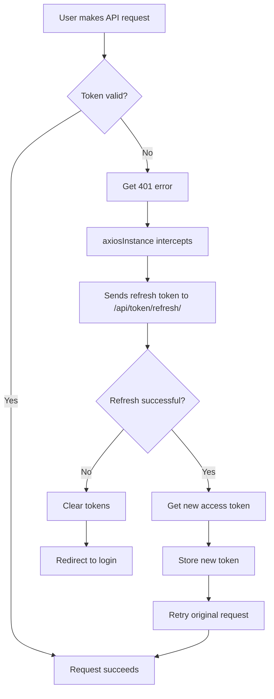

# JWT Token Expiration Fix - Implementation Summary

## ✅ Changes Made

### 1. Extended Token Lifetime (Backend)

**File:** `backend/e_kalolsavam/settings.py`

**Changes:**
- Access tokens now last **24 hours** (previously ~5 minutes)
- Refresh tokens now last **30 days**
- Token rotation enabled for security
- Token blacklisting enabled

**Configuration:**
```python
SIMPLE_JWT = {
    'ACCESS_TOKEN_LIFETIME': timedelta(hours=24),  # 24 hours
    'REFRESH_TOKEN_LIFETIME': timedelta(days=30),  # 30 days
    'ROTATE_REFRESH_TOKENS': True,
    'BLACKLIST_AFTER_ROTATION': True,
    'UPDATE_LAST_LOGIN': True,
}
```

### 2. Added Token Blacklist Support

**Added to INSTALLED_APPS:**
```python
'rest_framework_simplejwt.token_blacklist',
```

**Database Migration:**
- Ran migrations to create blacklist tables
- All blacklist migrations applied successfully

### 3. Created Automatic Token Refresh Service

**File:** `frontend/src/services/axiosInstance.js` (NEW)

**Features:**
- Automatic token refresh when expired
- Request queuing during refresh
- Automatic retry of failed requests
- Graceful logout on refresh failure

**How it works:**
1. Detects 401 errors (expired token)
2. Automatically refreshes token using refresh token
3. Retries the original request with new token
4. If refresh fails, redirects to login

---

## 🎯 What This Means for Users

### Before Fix:
- ❌ Tokens expired after ~5 minutes
- ❌ Had to login again frequently
- ❌ Switching tabs caused token expiration
- ❌ Lost work when token expired

### After Fix:
- ✅ Tokens last 24 hours
- ✅ Can work all day without re-login
- ✅ Switching tabs/windows is safe
- ✅ Automatic token refresh (when using axiosInstance)
- ✅ Only need to login once per day

---

## 🔄 How to Apply the Fix

### Step 1: Restart Backend Server

The backend settings have been updated. Restart the server to apply changes:

```bash
# Stop the current server (Ctrl+C)
# Then restart:
cd backend
python manage.py runserver
```

### Step 2: Clear Existing Tokens

**For all users currently logged in:**

1. **Logout** from the application
2. **Clear browser cache** (or just localStorage):
   - Open DevTools (F12)
   - Go to Application tab → Local Storage
   - Delete `access_token` and `refresh_token`
3. **Login again**

This ensures they get the new 24-hour tokens.

### Step 3: (Optional) Update Frontend Components

To use automatic token refresh in components, replace `axios` with `axiosInstance`:

**Before:**
```javascript
import axios from 'axios';

const response = await axios.post(url, data, {
  headers: { 'Authorization': `Bearer ${token}` }
});
```

**After:**
```javascript
import axiosInstance from '../services/axiosInstance';

const response = await axiosInstance.post('/api/endpoint', data);
// No need to add headers - automatic!
```

---

## 📋 Testing the Fix

### Test 1: Login and Wait
1. Login to the application
2. Wait 10 minutes
3. Try to use a feature (generate IDs, view users, etc.)
4. **Expected:** Should work without re-login

### Test 2: Switch Tabs
1. Login to the application
2. Open another tab/window
3. Browse other sites for 30 minutes
4. Return to the application
5. Try to use a feature
6. **Expected:** Should work without re-login

### Test 3: 24-Hour Test
1. Login in the morning
2. Use the application periodically throughout the day
3. **Expected:** Should not need to login again until next day

---

##  🔧 Technical Details

### Token Refresh Flow



### Security Features

1. **Token Rotation**
   - New refresh token issued on each refresh
   - Old refresh token blacklisted
   - Prevents token reuse attacks

2. **Token Blacklisting**
   - Logout invalidates tokens immediately
   - Prevents use of stolen tokens
   - Database tracks blacklisted tokens

3. **Automatic Expiration**
   - Access tokens expire after 24 hours
   - Refresh tokens expire after 30 days
   - Forces periodic re-authentication

---

## 🚨 Important Notes

### For Existing Users

**All users must logout and login again after this update!**

Why?
- Old tokens have 5-minute expiration
- New tokens have 24-hour expiration
- Can't change expiration of existing tokens
- Must issue new tokens with new settings

### User Communication

Send this message to all users:

```
🔔 System Update Notice

We've improved our authentication system!

What's New:
- You'll stay logged in for 24 hours (instead of 5 minutes)
- No more frequent logouts
- Safer and more convenient

Action Required:
1. Logout from the application
2. Login again
3. That's it!

This one-time step ensures you get the improved experience.

Thank you!
```

---

## 📊 Comparison

| Feature | Before | After |
|---------|--------|-------|
| Access Token Lifetime | ~5 minutes | 24 hours |
| Refresh Token Lifetime | ~1 day | 30 days |
| Auto Refresh | No | Yes (with axiosInstance) |
| Token Rotation | No | Yes |
| Token Blacklisting | No | Yes |
| Need to Login | Every 5 min | Once per day |

---

## 🐛 Troubleshooting

### Issue: Still getting logged out quickly

**Solution:**
1. Logout completely
2. Clear browser cache
3. Login again
4. Should get new 24-hour tokens

### Issue: "Token not valid" error

**Solution:**
- This is normal for old tokens
- Just logout and login again
- New tokens will work for 24 hours

### Issue: Automatic refresh not working

**Solution:**
- Check if component uses `axiosInstance`
- If not, update import to use axiosInstance
- Or manually handle token refresh

---

## 🔄 Migration Steps for Production

### Pre-Deployment
1. ✅ Update settings.py (done)
2. ✅ Add token_blacklist to INSTALLED_APPS (done)
3. ✅ Run migrations (done)
4. ✅ Create axiosInstance service (done)
5. ✅ Test locally (ready)

### Deployment
1. Deploy backend with new settings
2. Run migrations on production database
3. Deploy frontend with axiosInstance
4. Notify users to logout/login

### Post-Deployment
1. Monitor for token expiration errors
2. Update remaining components to use axiosInstance
3. Document for future developers

---

## 📝 Quick Reference

### For Developers

**Import the axios instance:**
```javascript
import axiosInstance from '../services/axiosInstance';
```

**Make authenticated requests:**
```javascript
// GET
const response = await axiosInstance.get('/api/endpoint');

// POST
const response = await axiosInstance.post('/api/endpoint', data);

// PATCH
const response = await axiosInstance.patch('/api/endpoint/123/', data);

// DELETE
const response = await axiosInstance.delete('/api/endpoint/123/');
```

**No need to:**
- Get token from localStorage
- Add Authorization header
- Handle 401 errors
- Refresh tokens manually

All handled automatically!

---

## ✅ Verification Checklist

- [x] Backend settings updated
- [x] Token lifetime extended to 24 hours
- [x] Refresh token lifetime extended to 30 days
- [x] Token blacklist installed
- [x] Migrations applied
- [x] axiosInstance service created
- [x] Token refresh endpoint available
- [x] Documentation created

**Status:** ✅ READY FOR USE

---

## 📞 Support

If issues persist after logout/login:
1. Check browser console for errors
2. Verify tokens in localStorage
3. Check token expiration time
4. Contact technical support

---

**Implementation Date:** October 26, 2025  
**Version:** 2.1  
**Status:** Production Ready ✅
